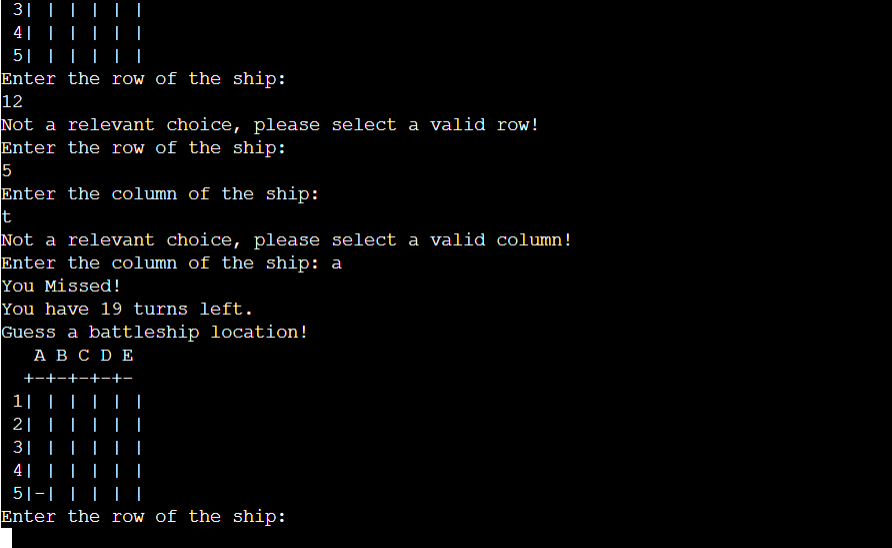
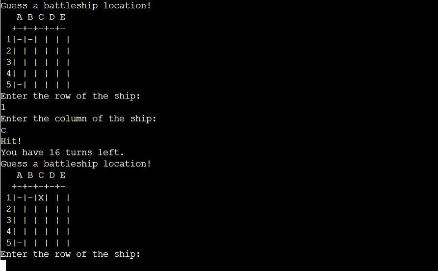
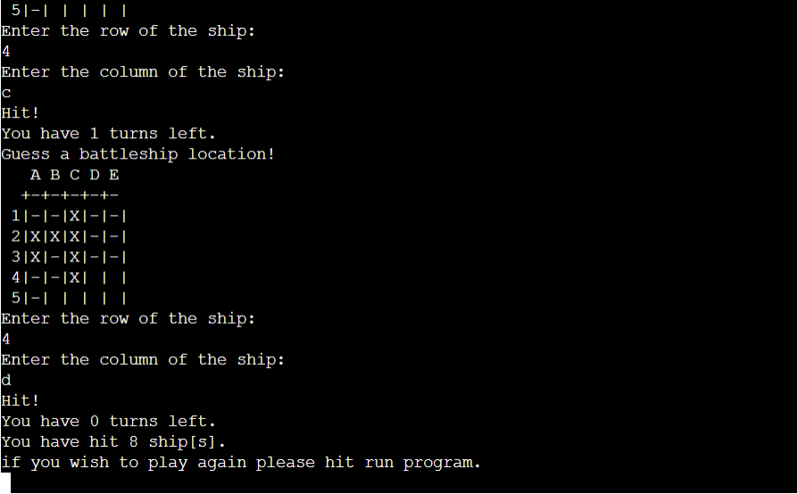

<h1 align="center">Battleship</h1>

## <U>**Introduction**</U>
Battleships is the game where classic game of trying to guess the position of battleships in order to sink them. In this version of the game you play gainst the computer and try to sink all of his battleships. The game is pure python and is displayed in a mock terminal.

[View battleship-wars here]()

## <u>**Gameplay**</u> ##

Battleship down is an enjoyable game of chance. In my version of the game, The player picks a grid size between 5 and 26 squared and then the ships are automatically spread scross the grid. The larger the grid the harder the game. the largest grids are near impossible to beat. For this reason you will receive a count at the end of how many battleships you hit so you can keep score of your best efforts on different sized grids. The aim of the game is to correctly guess a row and a column to find the battleship. The hits are denotated by and 'X' and the misses by a '-'. You get 20 attemps to guess the battleship location and when your turns are used up the game is over unless you have correctly found all ten battleships.

## <u>**User experience**</u> ##

**User goals**
 * As a user I want to enjoy the game and have fun.
 * As a user I want the game to have difficulty levels that I can set at the start.

**Project goals**
 * As the game developer I want the user to enjoy the game.
 * As the game developer I want the user to want to return to the game.
 * As the game developer I want the game to function with no bugs.

**User stories**
 * As a user I want to be able to understand the rules of the game.
 * As a user I want to be able to view my score.
 * As a user I want to clearly understand when I have won and when i have lost the game.
 * As a user I want to be able to play the game again.
 

## **Design**
 

## **Testing**

**Code validation**

* The [pep8 validator](http://pep8online.com) is down so I used inbuilt validation to address any major errors in my code. This returned zero problems in the run.py file.

 * **Code validation**

 * The following are screenshots of the game structure, gameplay and validation messages.

 * The below image is the welcome screen with instructions and the command to enter a grid size form 5 to 26.

 * The below image is when an invalid gird size outside the paremeters of 5 and 26 is entered. This was tested with multiple inputs and it performed as expected.

 * The below image is the grid displayed when a valid grid size has been entered.

 * The below image is the validation for an incorrect input for the row option. This was tested with multiple inputs and it performed as expected.

 * The below image is the option to select a valid column entry. 

 * The below image is the validation fo an incorrect input in the column option. This was tested with muliple inputs and it performed as expected

 * The below image is when a valid input has been entered for both the row and the column. In this case it displays a '-' which is a miss.

 * The below image is of and 'X appearing on the board as a ship has been correctly guessed and it registers as a hit.

* The below image is an end of game message. In this case all ships have not been sunk and the users score is displayed. An instruction on how to play again also appears.

  ## <u>**Testing**</u> ##

  The project was tested throughout the build in the terminal and also by the following methods.

   * The code was tested in the PEP8 linter and displayed no issues.
   * The game was testeed by entering incorrect coordinates, by entering input that was not a number and also by entering a guess in the same space for a second time.
   * 

* **Bugs**

I encountered the following bugs during the build of this project.

 * 

## <u>**Deployment**</u> ##

**Heroku**

1. Push the project to GitHub using vs-code, and make sure you have pushed the final version.
2. On Heruko sign up for a free account or sign in with an existing one.
3. Select new in the top right corner. From the menu chose "Create new app".
4. Choose a unique name for the app and the correct region that you are in.
5. Click on the "Create app".
6. In the deployment section select "Connect to GitHub"
7. Select the project that was relevant to the project you want to deploy, and click "Connect".
8. Go to the settings tab.
9. Scroll to the section named "Buildpacks", from here you then click "Add Buildpacks".
10. Select Python, and save changes.
11. Select NodeJs, and save changes.
12. Make sure that Python is first and not NodeJs, you can change the order of them by dragging and dropping them.
13. Add a config var. The key will be "PORT" and the value is "8000", make sure you spell PORT in all capital letters.
14. Navigate to the deploy tab.
15. Scroll down and select "Manual Deploy" and select "Deploy Branch".
16. Heruko will notify you when the app is successfully deployed.
17. If you want to rebuild your app automatically you can also select the 'Enable Automatic Deploys' button which will then rebuild the app every time you push any changes.

## <u>**Credits**</u> ##

## <u>**Acknowledgments**</u> 
