<h1 align="center">Battleship Wars</h1>

## <U>**Introduction**</U>
Battleship is a game of chance where you try to guess the position of battleships in order to sink them. In this version of the game you play against the computer and try to sink all of the battleships. This game is targeted at all audiences. Th game battleship holds a nostalgic value for myself and im sure for many others who have played it for many years. The game is still popular both as a boardgame and as an online challenge. The game is pure python and is displayed in a mock terminal provided by Code Institute.

[View battleship-wars here](https://battleship-wars-game.herokuapp.com/)

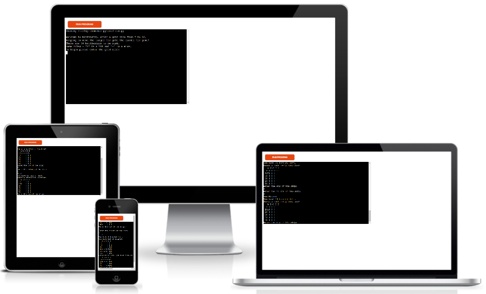

## <u>**Gameplay**</u> ##

Battleship wars is an enjoyable game of chance. In my version of the game, The player picks a grid size between 5 and 26 squared and then the ships are automatically spread scross the grid. The larger the grid the harder the game with the largest grids being near impossible to beat. For this reason you will receive a count at the end of how many battleships you hit so you can keep score of your best efforts on different sized grids. The aim of the game is to correctly guess a row and a column to find the battleship. The hits are denotated by and 'X' and the misses by a '-'. You get 23 attempts to guess the battleship location and when your turns are used up the game is over unless you have correctly found all ten battleships.

## <u>**User experience**</u> ##

**User goals**
 * As a user I want to enjoy the game and have fun.
 * As a user I want the game to have varying difficulty levels.

**Project goals**
 * As the game developer I want the user to enjoy the game. The ideal game size in order to beat this game are the lowest grid sizes however I decided to let the grid sizes go up to the length of the alphabet for any user interested in taking on near impossible games to see what they can score in these games. 
 * As the game developer, I want the user to want to return to the game.
 * As the game developer, I want the game to function with no bugs.

**User stories**
 * As a user I want to be able to understand the rules of the game.
 * As a user I want to be able to view my score.
 * As a user I want to clearly understand when I have won and when I have lost the game.
 * As a user I want to be able to play the game again.
 

## **Design**
 

## **Testing**

**Code validation**

* The [pep8 validator](http://pep8online.com) is offline so I used inbuilt validation to address any major errors in my code. This returned zero errors in the run.py file.

**Gameplay and input validation**

The following are screenshots of each step of the game including input validation. I entered multiple characters throughout the testing of this game and the results always performed as expected. 

* The below image is the welcome screen with instructions and the command to enter a grid size from 5 to 26.

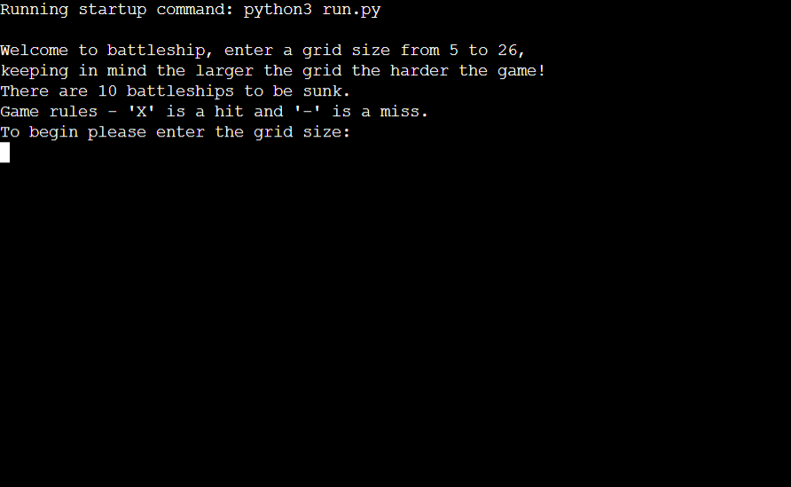

* The below image is when an invalid grid size outside the paremeters of 5 and 26 is entered. This was tested with multiple invalid inputs and it performed as expected.

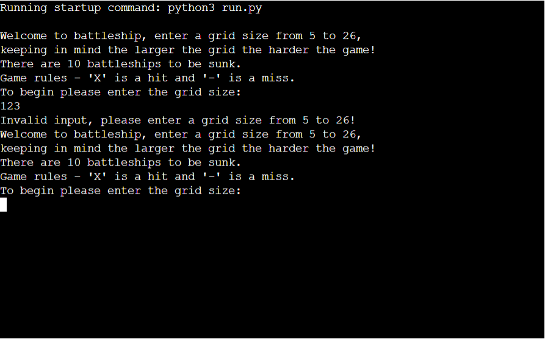

* The below image is the grid displayed when a valid grid size has been entered.

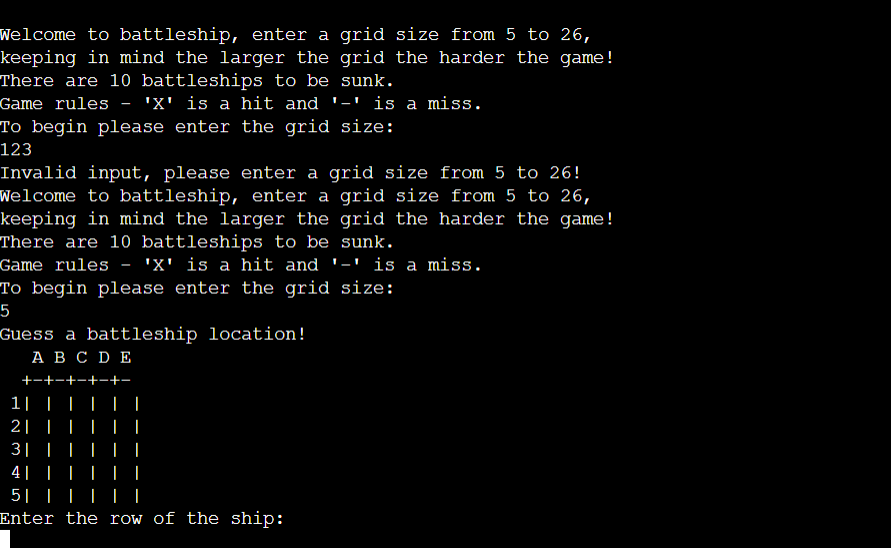

* The below image is the validation for an incorrect input for the row option. This was tested with multiple invalid inputs and it performed as expected.

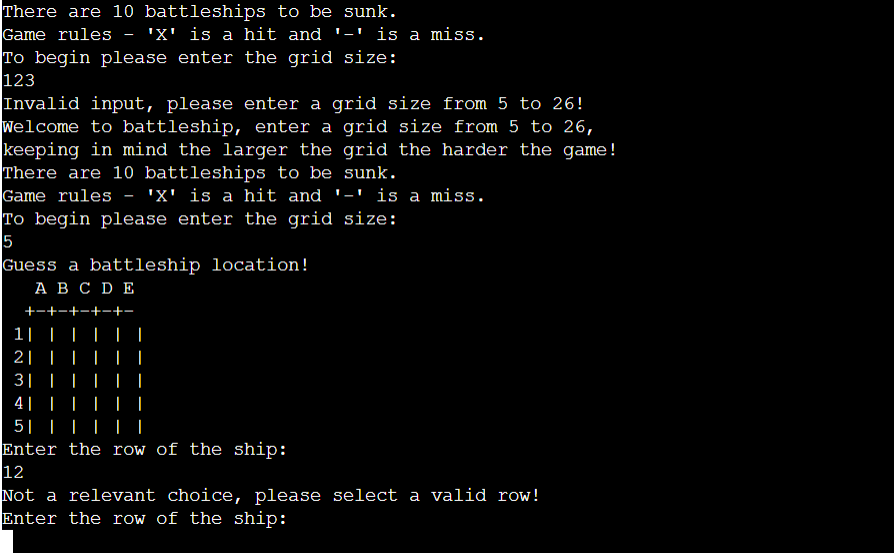

* The below image is the option to select a valid column entry. 

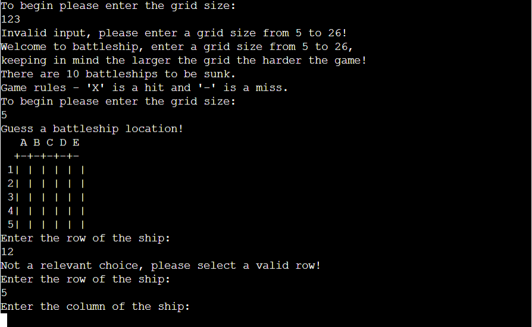

* The below image is the validation for an incorrect input in the column option. This was tested with multiple invalid inputs and it performed as expected.

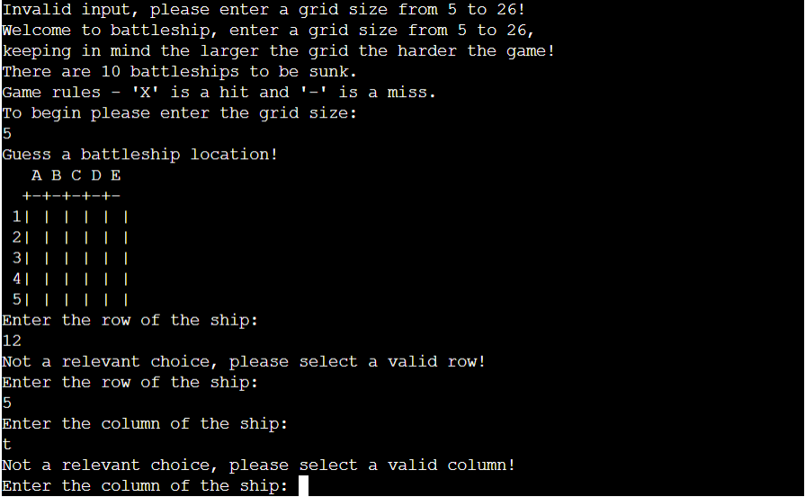

* The below image is when a valid input has been entered for both the row and the column. In this case it displays a '-' which is a miss.

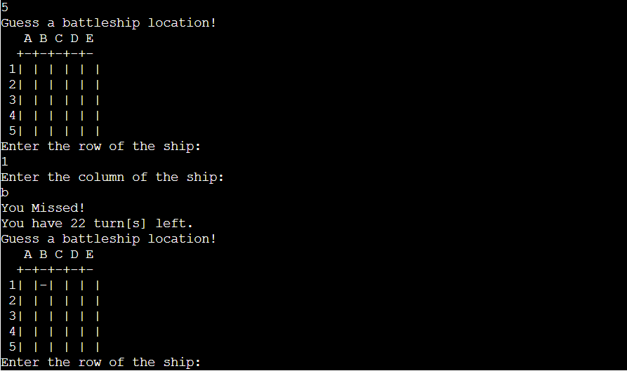

* The below image is of an 'X' appearing on the board as a ship has been correctly guessed and it registers as a hit.

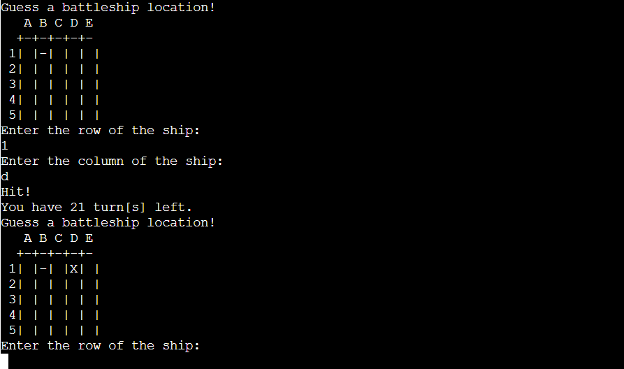

* The below image is an end of game message. In this case all ships have not been hit and the users score is displayed.

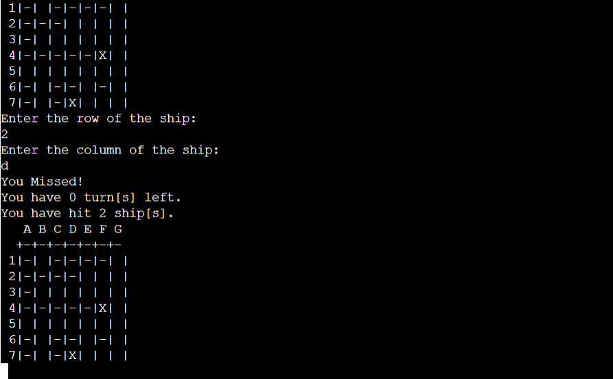

* The below image is the display when all 10 ships have been hit.

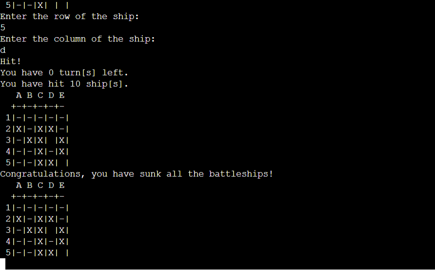

## **Bugs**

I encountered the following bugs during the build of this project.

 * The guess and hidden board were declaring as local variables which was creating two problems in the terminal. I addresssed this by declaring both as global variables.

 * The letters would not display properly over the grid lines. The solution to this problem was to enter and extra space in the quotes where it declares top_labels in the print board function.

 * The validation of the columns was not working as expected. I used the strip() method to solve this problem and the validation then worked as expected.

 ## **Technologies used**

 The following languages and technologies were used and implemented in the build of this project.

  * Python was the language used for the build of this project including the the 'random' imported library in whcih 'randint' was used.

  * VS Studio Code was used to write the python code and to commit and push to GitHub.

  * Git - For version control.

  * Github - To save and store the files for the website construction.

  * Am I Responsive? - To give a visual representation of the game in the provided mock terminal.

## <u>**Deployment**</u> ##

**Heroku**

1. Push the project to GitHub using vs-code, and make sure you have pushed the final version.
2. On Heruko sign up for a free account or sign in with an existing one.
3. Select new in the top right corner. From the menu chose "Create new app".
4. Choose a unique name for the app and the correct region that you are in.
5. Click on the "Create app".
6. In the deployment section select "Connect to GitHub"
7. Select the project that was relevant to the project you want to deploy, and click "Connect".
8. Go to the settings tab.
9. Scroll to the section named "Buildpacks", from here you then click "Add Buildpacks".
10. Select Python, and save changes.
11. Select NodeJs, and save changes.
12. Make sure that Python is first and not NodeJs, you can change the order of them by dragging and dropping them.
13. Add a config var. The key will be "PORT" and the value is "8000", make sure you spell PORT in all capital letters.
14. Navigate to the deploy tab.
15. Scroll down and select "Manual Deploy" and select "Deploy Branch".
16. Heruko will notify you when the app is successfully deployed.
17. If you want to rebuild your app automatically you can also select the 'Enable Automatic Deploys' button which will then rebuild the app every time you push any changes.

## <u>**Credits**</u> ##

* The project "love sandwiches" for the initial set up and helping me get started.
* [Knowledge Mavens](https://www.youtube.com/watch?v=tF1WRCrd_HQ) for giving me structure for my game and also I used the join row method displayed in this tutorial.
* Antonio Rodriguez, my mentor for assisting me in writing this code to fix the column input which was not working - 'columns = list("ABCDEFGHIJKLMNOPQRSTUVWXYZ")[: size].

## <u>**Acknowledgments**</u> 

* Antonio Rodriguez my mentor for helping me focus on the solutions and not the problems and for also making himself available at short notice if I found myself in need of help.
* The code institute tutors for patiently helping me through difficult periods as my deadline was approaching.
* My family for being so patient with me spending untold hours locked in a room working on this project.
